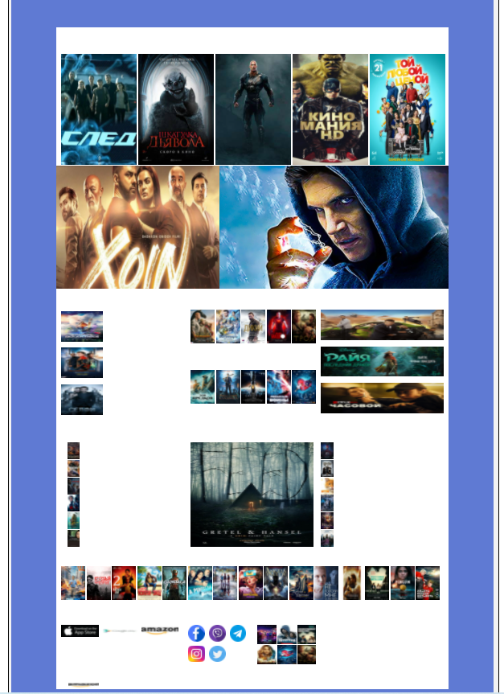

МИНИСТЕРСТВО НАУКИ И ВЫСШЕГО ОБРАЗОВАНИЯ

РОССИЙСКОЙ ФЕДЕРАЦИИ

ФЕДЕРАЛЬНОЕ ГОСУДАРСТВЕННОЕ БЮДЖЕТНОЕ ОБРАЗОВАТЕЛЬНОЕ

УЧРЕЖДЕНИЕ ВЫСШЕГО ОБРАЗОВАНИЯ

«ВЯТСКИЙ ГОСУДАРСТВЕННЫЙ УНИВЕРСИТЕТ»

Институт математики и информационных систем

Факультет автоматики и вычислительной техники

Кафедра систем автоматизации управления

 

Дата сдачи на проверку:

«15» май 2021 г.

Проверено:

«__» Апреля 2021 г.

Методы формирования html5 документов

Отчет по лабораторной работе № 3

по дисциплине

«Основы frontend-разработки и организации человеко-машинного интерфейса»

  

Разработал студент гр. ИТб-1303-01-00 ________________ /Рабие А.И/

Проверил ст. преподаватель _________________ /Земцов М.А./

Работа защищена с оценкой	«___________» «___» __________ 2021 г.

   

Киров 2021  

---

 Цель лабораторной работы: Стилизация и трансформация элементов через CSS. CSS процессоры.

 Задачи лабораторной работы:  

1. Организовать процесс работы над лабораторной работой
2. Изучить материал по основам стилизации элементов
3. Выполнить верстку макета по заданию преподавателя
4. Составить отчет по выполненным задачам
5. Защитить лабораторную работу

